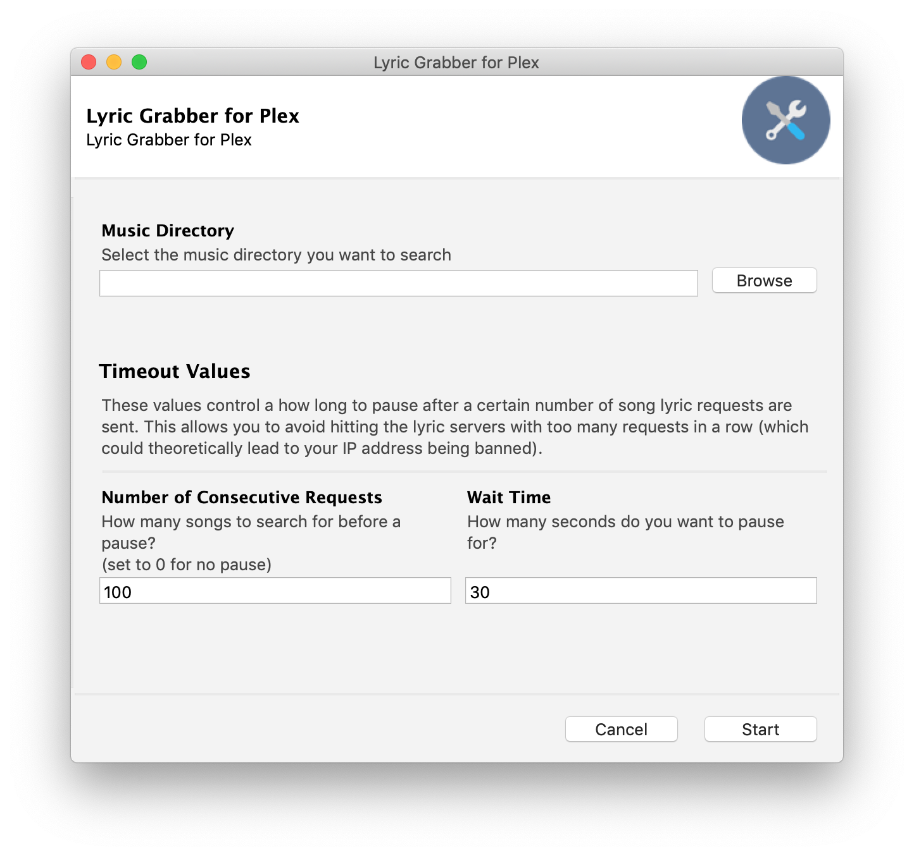

Lyric Grabber for Plex
=======================

Lyric Grabber for Plex automatically searches a folder (and any inner folders) of music for audio files, read their metadata, downloads the lyrics for any song it can find, and saves them in the format that [Plex](https://www.plex.tv/) expects. The lyrics are saved into the same folder as the music file was in, named the same thing as the audio file, but with a .txt file extension.

This allows you to see the lyrics for the songs you are listening to via Plex. Although LyricFind (automatically set up with your Plex Pass) works well, and I prefer it when possible, having local lyrics saved allows me to see the lyrics to many more songs than LyricFind can.

Screenshots
===========

Installation
=============

Download the Mac or Windows file [from the most recent release here](https://github.com/schellenberg/lyric-grabber-for-plex/releases). 

On a Mac, you may need to right click, then click "Open". This lets you open an application that is unsigned.

Configuring Plex
=================

Enable "Local Media Assets" in Settings (under Agents). [Read this support article for full details.](https://support.plex.tv/articles/215916117-adding-local-lyrics/)

About
======

Lyric Grabber for Plex is a simple GUI wrapper (built with [Gooey](https://github.com/chriskiehl/Gooey)) on a slightly customized version of the Python command line program [lyrico](https://github.com/abhimanyuPathania/lyrico).

Audio Formats and Tags
=======================
Below is the list of supported audio formats and their supported tags:
- mp3 (ID3 Tags)
- flac (Vorbis Comments)
- m4a, mp4 (MP4 Tags (iTunes metadata))
- wma (ASF)
- ogg, oga (Vorbis Comments)

Cautions
====================

- **Your tags** - Lyric Grabber uses metadata in your tags for building URLs. Hence your songs should be tagged with correct 'artist', 'title' information. [MusicBrainz Picard](https://picard.musicbrainz.org/) is a nice way to edit the metadata of your files.

A Note on Mass Downloading
===========================

Since Lyric Grabber uses `lyrico` to simply scrape lyrics off the HTML pages of the sources, please don't set the music directory to search to be a folder having thousands of songs. `az_lyrics` sometimes bans your IP if you hit them with too many failed requests. Refreshing your IP by restarting your router or using a VPN solves that.

It is probably best to download lyrics for a few albumns at a time, though your mileage may vary.
